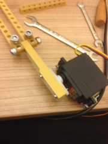
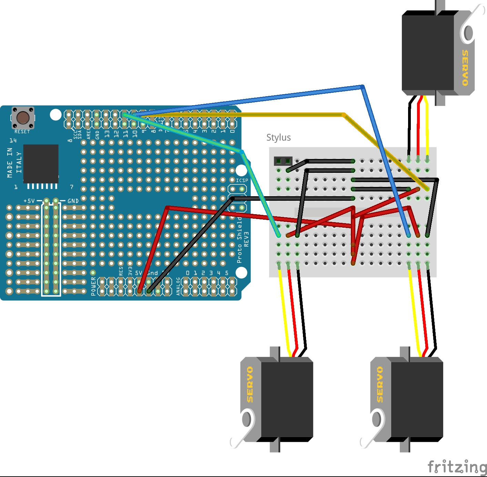

Building Instructions
=====

Robot
---

***Before building the robot you should connect the electronics once and run dance(); to make sure everything is working. Also you should use a round file on 3D printed parts to make sure all holes are fitting.***

<h3>Base</h3>

Take the base plate and fix three 5x1 beams to the base plate using M5 20mm/10-32 3/4 inch screws and the low-profile nuts. Connect the side panels to those beams using the same combination of screws and nuts.

<h3>Actuator</h3>

***Make sure not the tighten the screws on the actuator. Each part should be moving without using a lot of power.***

Take two 2 17x1 plates and fix a 2x1 beam to each of it ends using the M5 20mm/10-32 3/4 inch screws and lock nuts. Repeat three times.

Connect two arms to each connector of the stylus holder. Use the M5 30mm/10-32 1 1/4 inch screws and lock nuts. Please note that the stylus holder has two sides, the smooth side should be visible (like on the picture) and the screws of the arms should face up.

Connect the upper arm to each of the three arms connected to the stylus holder. Use the M5 30mm/10-32 1 1/4 inch screws and lock nuts. Connect each servo to the upper arm using the screws that came with the servo. The servo should be parked in its zero point when doing this and you need to screw the 2-side horn on the servo (see the servo's instructions). Use the second hole on each side of the horn for the screws. (Please note that the screws on the end of the arm are upside-down.)

Fix the servo mounts to the servos using a M3 18 mm / 6-32 3/4 inch screw and the equivalent nuts for each side. (Note that that the upper arm was exchanged for a 9x1 beam in the picture.)

<h3>Top</h3>

Connect three 9x1 beams to the top plate using the M5 20 mm / 10-32 3/4 screws and low-profile nuts. The screw head should be upper surface of the top plate.

Connect the servo mounts to the 9x1 beams using M5 25 mm / 10-32 1 inch screws and low-profile nuts. Run the servo cables in the hole of the top plate. Please make sure that the servo horns are all facing to the right side and each servo mount is mounted to the left side of the 9x1 beam.
Also note that the 17x1 plates are facing to the outside and the screws heads on the stylus mount  

If you connected it the right way the arm should be movable in each direction without any colliding screws or similar.

Connect a 5x1 beam to each of the side parts using M5 20 mm / 10-32 3/4 inch screws and low-profile nuts. 

Fix the top with the actuator to the rest of the casing using M5 20 mm / 10-32 3/4 inch screws and low-profile nuts.

<h3>Stylus</h3>

Insert the stylus into the stylus mount. You may need to use tape on the stylus or a rasp to insure a tight fit.

<h3>Arduino mount</h3>

Mount the Arduino to the Arduino plate using the A2 M2.5 12mm / 4-40 1/2 inch screws and nylon nuts. Make shure not to tighten the screws. The arduino should be fixed but the PCB should never bent!

Mount two 9x1 beams and the Arduino plate on the top using M5 25 mm / 10-32 1 inch screws and low-profile nuts.

Electronics
----

<h3>Preparations</h3>

Take the ProtoShield and and stack it on the Arduino (Don't press two hard!). Glue the mini breadboard on the ProtoShield using the glue pad that came with the breadboard.

<h3>Connecting the Servos</h3>

Insert a row of three male headers into the servo's connector and connect the servos to the breadboard. See this plan on how to connect everything with jumper cables:

Installing Firmware
----
Connect your Arduino to your PC or Mac and run the Arduino Software (Download it at [arduino.cc](http://arduino.cc/en/Main/Software#toc2)). Select File -> Examples -> Firmdata -> StandardFirmdata and click the "Upload" button in the newly opened window.

After installing the StandardFirmware you can run the bot.js file from src directory with `node bot.js`. See [README.md](README.md) for further instructions

<h4>Copyright notice</h4>
Most images in this document are made by Abby Raskin. All rights reserved.
The images from the upper arm are made by Philip Brechler. Free to use for anyone.