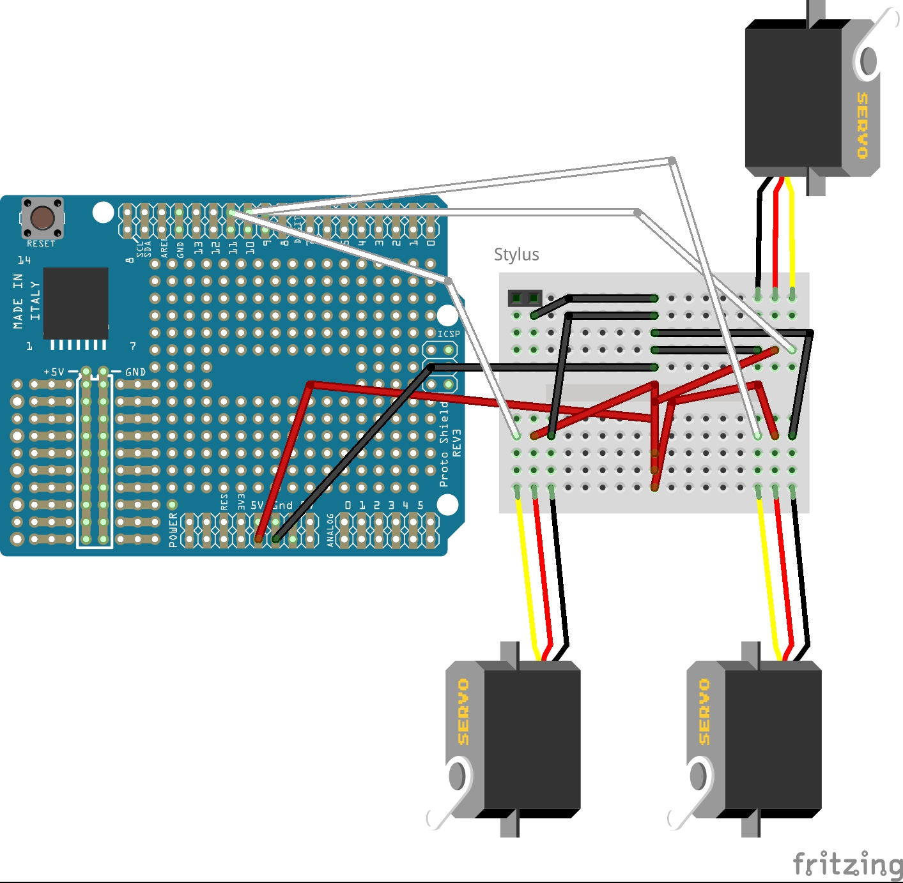

Building Instructions
=====
Electronics
----

<h3>Preperations</h3>

Take your Arduino and your Arduino ProtoShield out of their boxes and stack the ProtoShield on the Arduino (Don't push to hard!). Take the mini breadboard and stack it on the ProtoShield.

<h3>Connecting the Servos</h3>

Insert a row of three male headers into the Servo's conenctor and connect the servos to the breadboard. See this plan on how to connect the everything with jumper cables:

